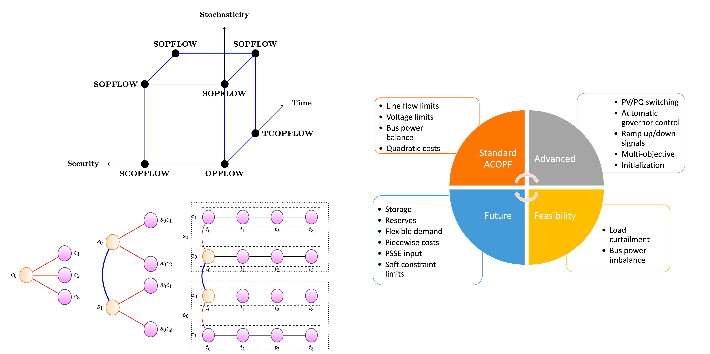

# <b>Exa</b>scale <b>G</b>rid <b>O</b>ptimization toolkit (ExaGO<sup>TM</sup>) [](https://github.com/pre-commit/pre-commit)    

<!---->




ExaGO<sup>TM</sup> is a package for solving large-scale  power grid optimization problems on parallel and distributed architectures, particularly targeted for exascale machines with heteregenous architectures (GPU). Combinations of stochastic, contingency-constrained, multiperiod ACOPF problems can be solved with ExaGO. The package is written in C/C++ with python bindings available for python-based applications. An overview of the package is given on this page. For extended information, including the modeling details and formulations, see the [ExaGO manual](docs/manual/manual.pdf). 

ExaGO<sup>TM</sup> includes the following applications for solving different power grid optimization problems:

- [OPFLOW](docs/web/opflow.md) solves an AC optimal power flow either on CPU and GPU
- [TCOPFLOW](docs/web/tcopflow.md) solves a multi-period optimal power flow
- [SCOPFLOW](docs/web/scopflow.md) solves a security-constrained (contingency-constrained) optimal power. Both single-period and multi-period problems can be solved.
- [SOPFLOW](docs/web/sopflow.md) solves a stochastic optimal power flow with (optional) security constraints for single and multiple periods.

ExaGO<sup>TM</sup> applications are interfaced with the following optimization solver packaages:

- [Ipopt](https://github.com/coin-or/Ipopt) is a popular optimization package for solving nonlinear optimization problems that uses an interior-point algorithm.
- [HiOp](https://github.com/LLNL/hiop) is a HPC package for optimization. ExaGO interfaces with two of its solvers -- a mixed sparse-dense interior-point solver (NewtonMDS) and a sparse interior-point solver (HiOPSparse). NewtonMDS  allows execution of the optimization either on CPU and GPU. The sparse HiOp solver is currently supported on CPU only.

Note that not all applications can utilize all solvers yet. The following table lists the solver-application compatibility.

|  Solver   | OPFLOW  | TCOPFLOW | SCOPLOW | SOPFLOW |
|:------:|:---------:|:-----:|:-------:|:-------:|
| Ipopt      | Y         |  Y     | Y       | Y       | 
| HiOp       | Y          |       |   Y      |  Y       |

Additionally, note that SCOPFLOW and SOPFLOW with HiOp solver use Ipopt to solve a portion of the problem (base problem). So one must also configure with Ipopt when using HiOp solver for these applications.

## Installing

Details installation instructions are given at [INSTALL.md](./INSTALL.md) for information on acquiring, building and installing ExaGO.

If you are a developer with access to the project, we also provide public binaries that are generated through our GitHub actions workflows documented in [README.md](.github/workflows/README.md), and with documentation about usage in the packages section of our repository. Check out a short (< 60s demo) of pulling down a version of ExaGO:

[](
https://asciinema.org/a/KCi5TmUXc6zWDj7JYHzfSFxmw)

## Developer Guide

You can view the following helpful documentation sources:
- [test_add.md](docs/web/test_add.md) markdown file for information on adding tets (outdated)
- [README.md](buildsystem/README.md) for our bash / spack buildsystem used in GitHub/GitLab CI/CD
- [README.md](buildsystem/spack/README.md) for our spack specific build scripts that support CI tcl modules on HPC target platforms
- [README.md](docs/devcontainer/README.md) for our devcontianer configuration information (codespace support coming soon)
- [exago_policy_compatiblility](docs/exago_policy_compatibility.md) for xSDK compatibility guidelines, and ways to enforce compliance
- [python_bindings.md](docs/python_bindings.md) for documentation about or Python bindings
- [README.md](performance_analysis/README.md) for information about profiling ExaGO with spack
- [README.md](.github/workflows/README.md) for details about our GitHub actions

## Vizualisation

Our ChatGrid frontend deployed with React, PSQL and LangChain has documentation in [README.md](viz/README.md) as well as a pdf [README.pdf](viz/README.pdf) in the `viz` subdirectory. Several of our tutorials install this through commands in Jupyter Notebooks as well.


## Usage
Instructions for executing the different ExaGO<sup>TM</sup> applications is given below.
- [OPFLOW](docs/web/opflow.md)
- [TCOPFLOW](docs/web/tcopflow.md)
- [SOPFLOW](docs/web/sopflow.md)
- [SCOPFLOW](docs/web/scopflow.md)
- [PFLOW](docs/web/pflow.md)

We also provide our user manual as a pdf [manual.pdf](docs/manual/manual.pdf) -> need to update this regularly with CI / move to quarto docs.

## Tutorials

- If you are using a devcontainer with VSCode, the following tutorials are provided:
    - [tutorial.ipynb](docs/devcontainer/tutorial.ipynb) for basic configuration infromation and I/O
    - [mpi4py-tutorial.ipynb](docs/devcontainer/mpi4py-tutorial.ipynb) for mpi4py pointers and best practices
    - [viz-tutorial.ipynb](docs/devcontainer/viz-tutorial.ipynb) for spinning up our frontend visualization with ChatGrid integration
- Otherwise, you can check out our more in depth application tutorials in the `tutorials`subdirectory:
    - [demo1.ipynb](tutorials/demo1.ipynb) run OPFLOW, SCOPFLOW and visualize your output
    - [demo2.ipynb](tutorials/demo2.ipynb) run SOPFLOW on many ranks using MPI, and visualize outpu
        - TODO - add fixes from `mpi4py` devcontainer example into this notebook to show working MPI workflow

### Options

Each application has a different set of options that are described in depth in the usage notes. These options can be passed optionally through an options file (`-optionsfile <option_file>`), or directly on the command line.

Since options may be specified in more than one location (on the command line, and through an options file), it is worth noting that the option specified on the command line supersede those in the options file. For example, if `opflowoptions` options file set the network file via the option `-netfile case9mod.m`, the following behavior occurs:

```bash
# This uses case9mod.m
./opflow -optionsfile opflowoptions

# This uses case118.m
./opflow -netfile case118.m -options_file opflowoptions
```

## Visualization (experimental)
ExaGO has an experimental visualization to display the results of `OPFLOW` application on a map. See the [visualization README](viz/README.md) for more information.

## Contributing

Please see [the developer guidelines](docs/developer_guidelines.md) before attempting to contribute.
Feel free to raise an issue or contact the team if the guidelines are ambiguous or you have a particular question.

## Authors
- Shrirang Abhyankar
- Slaven Peles
- Asher Mancinelli
- Cameron Rutherford
- Bruce Palmer
- Jaelyn Litzinger
- William Perkins
- Sayef Azad Sakin
- Joseph Macam
- Ryan Danehy
- Nicholson Koukpaizan

## Acknowledgement
This package is developed as a part of [ExaSGD](https://www.exascaleproject.org/research-project/exasgd/) project under the [Exascale computing project](https://www.exascaleproject.org/).

## Copyright
Copyright &copy; 2020, Battelle Memorial Institute.

ExaGO<sup>TM</sup> is a free software distributed under a BSD 2-clause license. You may reuse, modify, and redistribute the software. See the [license](LICENSE) file for details.


## Disclaimer
This material was prepared as an account of work sponsored by an agency of the United States Government.  Neither the United States Government nor the United States Department of Energy, nor Battelle, nor any of their employees, nor any jurisdiction or organization that has cooperated in the development of these materials, makes any warranty, express or implied, or assumes any legal liability or responsibility for the accuracy, completeness, or usefulness or any information, apparatus, product, software, or process disclosed, or represents that its use would not infringe privately owned rights.
Reference herein to any specific commercial product, process, or service by trade name, trademark, manufacturer, or otherwise does not necessarily constitute or imply its endorsement, recommendation, or favoring by the United States Government or any agency thereof, or Battelle Memorial Institute. The views and opinions of authors expressed herein do not necessarily state or reflect those of the United States Government or any agency thereof.
