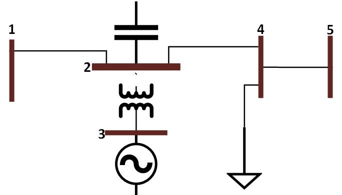
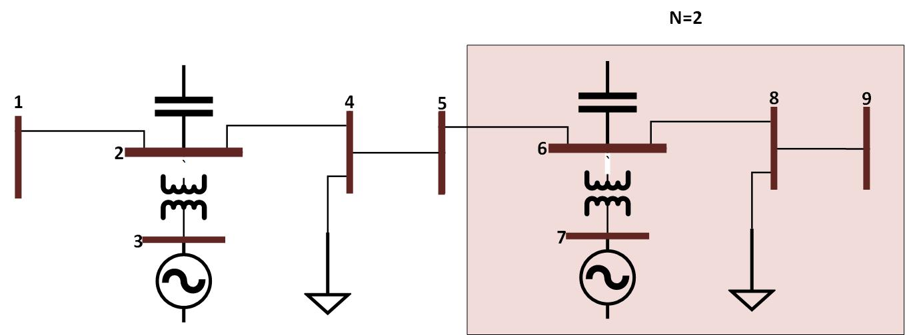

# Unit Test Design for ExaGO OPFLOW's Functions

## Goal
Design the scalable unit tests for varios ExaGO OPFLOW's functions.

## Organization
For each function, there is a separate folder that contains at least: documentation, input network with pre-set parameters and a script that is used for upscaling.

## Input files

### Format
ExaGO OPFLOW reads .m file, thus the input file for each unit test is in this format.

### Topology of the test network
A simple 5-bus network is used as a basis for the unit tests. A network consist of:
- 5 buses (1-5)
- 1 generator unit (at bus 3)
- 1 transformer (between buses 2 and 3)
- 3 lines (1-2, 2-4, 4-5)
- 1 switched shunt (at bus 2), and 
- 1 load (at bus 4).

Figure below shows the oneline diagram of the test network:

## Scaling
Idea is to be able to "multiply" the network, and at the same time being able to **easily** evaluate the functions. Network shown before is considered as a base segment (N=1).

Figure 2 shows the proposed multiplication of the grid with two segments connected (N=2):

### Algorithm
To be able to run the unit tests with the larger network, a new input file needs to be generated. Algorithm for the .m file generation with N segments of the base network is:
#### Bus data:
- Copy all but first bus data (column) N times and increment the numbering (First value in the column): (N-1)*4+First.
- Set all Second values in columns of elements with First number euqual to N*4-1 for N>1 (e.g., 7, 11, 15) to 2. This steps ensure that all buses with generator unit are marked as PV buses, and the first one with the generator is SLACK (Second=3 instead of 2).
- Total number of buses for N segments is N*4+1.
#### Generator data:
- Copy generator data N times.
- ONLY the first value in the generator field (bus number) needs to be updated for each copy = 3+(N-1)*4.
#### Generator cost data:
- Copy generator cost data N times.
#### Branch data:
- Copy all four branches N times.
- First two values in each columns are changing as follows: (N-1)*4+First and (N-1)*4+Second.
#### Bus name data:
- Copy all but first bus name data N times and increment the numbering: (N-1)*4+First. 
#### Generator unit types data:
- Copy generator unit types data N times.
#### Generator fuel types data:
- Copy generator fuel types data N times.

## Script

Scripts are wrriten is python are are based on the previously given algorithm.

## Functions to be tested
- **OPFLOWComputeObjective_PBPOL (done)**
- **OPFLOWComputeGradient_PBPOL (done)**
- **OPFLOWComputeEqualityConstraints_PBPOL (done)**
- **OPFLOWComputeInequalityConstraints_PBPOL (done)**
- **OPFLOWComputeEqualityConstraintJacobian_PBPOL (done)**
- **OPFLOWComputeInequalityConstraintJacobian_PBPOL(done)**
- OPFLOWComputeEqualityConstraintsHessian_PBPOL  
- OPFLOWComputeInequalityConstraintsHessian_PBPOL
- OPFLOWComputeObjectiveHessian_PBPOL
- **OPFLOWSetVariableBounds_PBPOL (done)**
- OPFLOWSetConstraintBounds_PBPOL
