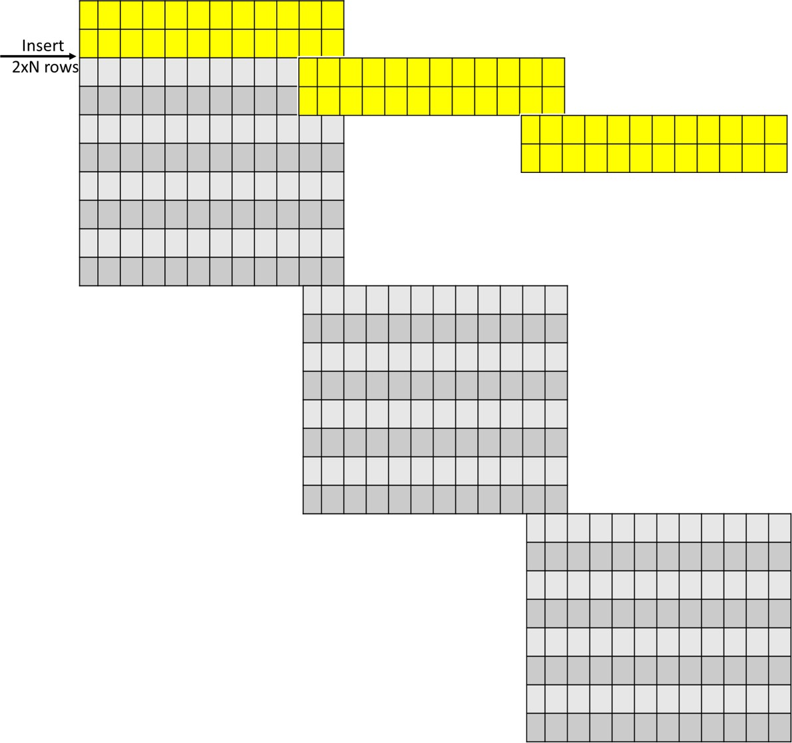

# Unit Test Design for ExaGO OPFLOW's  Inequality Constraints

## Goal
Design the scalable unit test for the OPFLOW function **OPFLOWComputeInequalityConstraints_PBPOL**.

## Inequality constraints
There are three "sets" of the inequality constraints:
- The apparent line flow constraints
- Constraints that are result of the control mode for the generator bus voltage (relate reactive power output and voltage)
- Constraints that are result of AGC

The apparent line flow constraints are considered on the square of the from and to bus flows.
```math
\begin{aligned}
0 \le S^2_f \le (S^+_{ft})^2 \\
0 \le S^2_t \le (S^+_{ft})^2
\end{aligned}
```
where the maximum flow,$`S^+_{ft}`$ is either the RATE_A (normal), RATE_B (short-term), or RATE_C (emergency) rating of the line.

The apparent power flows $`S_{f}`$ and $`S_{t}`$ at the from and to ends of the line are given by
```math
\begin{aligned}
S_f = \sqrt{P^2_{ft} + Q^2_{ft}} \\
S_t = \sqrt{P^2_{tf} + Q^2_{tf}}
\end{aligned}
```
$`P_{f}`$ and $`Q_{f}`$ are the real and reactive power flow from bus f to bus t on line ft. 
Similarly, $`P_{t}`$ and $`Q_{t}`$ are the real and reactive power flow from bus t to bus f.
These are given by
```math
\begin{aligned}
  P_f &=  G_{ff}(V^2_{f}) + V_{f}(G_{ft}V_{t}\cos(\theta_{f}-\theta_t) + V_{t}B_{ft}\sin(\theta_{f}-\theta_t)) \\
  Q_f &= -B_{ff}(V^2_{f}) + V_{f}(G_{ft}V_{t}\sin(\theta_{f}-\theta_t) - V_{t}B_{ft}\cos(\theta_{f}-\theta_t)) \\
  P_t &=  G_{tt}(V^2_{t}) + V_{t}(G_{tf}V_{f}\cos(\theta_{t}-\theta_f) + V_{f}B_{tf}\sin(\theta_{t}-\theta_f))  \\
  Q_t &= -B_{tt}(V^2_{t}) + V_{t}(G_{tf}V_{f}\sin(\theta_{t}-\theta_f) - V_{f}B_{tf}\cos(\theta_{t}-\theta_f))
\end{aligned}
```
Here, $`G_{ff}`$,$`G_{ft}`$ are the self and mutual conductances for line ft, while $`B_{ff}`$,$`B_{ft}`$ are the
self and mutual susceptances, respectively and are calculated form the line parameters as follows:

- $`G_{ff}=y_{ff}[0]=\dfrac{R}{R^2+X^2}\dfrac{1}{tap^2}`$
- $`B_{ff}=y_{ff}[1]=(\dfrac{-X}{R^2+X^2}+\dfrac{B_{c}}{2})\dfrac{1}{tap^2}`$
- $`G_{ft}=y_{ft}[0]=(-\dfrac{R}{R^2+X^2}*tap*\cos(shift)-\dfrac{X}{R^2+X^2}*tap*\sin(shift))\dfrac{1}{tap^2}`$
- $`B_{ft}=y_{ft}[1]=(\dfrac{X}{R^2+X^2}*tap*\cos(shift)-\dfrac{R}{R^2+X^2}*tap*\sin(shift))\dfrac{1}{tap^2}`$
- $`G_{tf}=y_{tf}[0]=(-\dfrac{R}{R^2+X^2}*tap*\cos(shift)+\dfrac{X}{R^2+X^2}*tap*\sin(shift))\dfrac{1}{tap^2}`$
- $`B_{tf}=y_{tf}[1]=(\dfrac{X}{R^2+X^2}*tap*\cos(shift)+\dfrac{R}{R^2+X^2}*tap*\sin(shift))\dfrac{1}{tap^2}`$
- $`G_{tt}=y_{tt}[0]=\dfrac{R}{R^2+X^2}`$
- $`B_{tt}=y_{tt}[1]=\dfrac{-X}{R^2+X^2}+\dfrac{B_{c}}{2}`$

For the generator with the voltage setpoint following two constraints are calculated:

- $`(Q-Q_{max})*(V_{set}-V)>=0`$
- $`(Q_{min}-Q)*(V-V_{set})>=0`$

**Add the constraints when opflow_has_gensetpoint**

## Inequality constraint Jacobian

Jacobian terms are calculated as partial w.r.t voltage magniude and angle at each bus, as well as w.r.t generator injections, (and load loss and power imbalance if enabled).
Dimensions of the matrix are:
- $`Number_of_rows = 2*Number_of_lines+2*Number_of_generators`
- $`Number_of_columns = 2*(Number_of_buses+Number_of_generators)+(2*Number_of_buses if load loss and power imbalance options are enabled)`


## Input

ExaGO OPFLOW reads .m file, thus the input file for unit test is in this format.
A 5-bus system **CICJ-unittestx1.m** will be used as a basis for this test. In addition, an artifical solution vector will be also generated as an input for the test.

### Parameters values in .m file

Following are the value of parameters of interest for this test:

- $`R_{branch}=2`$
- $`X_{branch}=1`$
- $`B_{branch}=1.2`$
- $`tapratio_{branch}=1`$ for all but transformer that has $`tapratio_{transformer}=2`$
- $`phaseshift_{branch}=0`$ for all but transformer that has $`phaseshift_{branch}=60`$
- $`Q_{gmax}=197.8`$
- $`Q_{gmin}=-202.2`$
- $`P_{d}=-3.4`$
- $`Q_{d}=-8.8`$
- $`G_{l}=0.25`$
- $`B_{l}=-0.05`$

- $`V_{set}=0.5`$


### Solution vector values

Following are the values of the solution vector's elements of interest for this test:

- $`theta=0`$ for all but transformer that has $`theta=30`$
- $`V_{m}=2`$
- $`P_{g}=1.6`$
- $`Q_{g}=-2.2`$

## Vectors for N=1

### Solution vector for N=1

Solution vector can be built with **OPFLOWSetInitialGuess_PBPOL**, but for the purpose of this unit test, solution vector will be build independently in such a way that only the values of the interest will be different than zero. 
In general, solution vector has following elements per bus:
1. Voltage angle
2. Voltage magnitude
3. Generator MW (if generator bus)
4. Generator MVar (if generator bus)

For the 5-bus system **CEC-unittestx1.m**, solution vector is:
<table>
<tr>
<td>0</td> <td>2</td> <td>0</td> <td>2</td> <td>30*PI/180.0</td> <td>2</td> <td>1.6</td> <td>-2.2</td> <td>0</td> <td>2</td> <td>0</td> <td>2</td> 
</tr>
</table>

### Matrix builder for inequality constraints Jacobian for the example network

For the considered network matrix for equality constraint Jacobian is built as follows:
<table>
<tr>
<td> </td> <td>theta1</td> <td>Vm1</td> <td>theta2</td> <td>Vm2</td> <td>theta3</td> <td>Vm3</td> <td>Pg3</td> <td>Qg3</td> <td>theta4</td> <td>Vm4</td> <td>theta5</td> <td>Vm5</td>
</tr>
<tr>
<td>IEC1</td> <td>0</td> <td>0</td> <td>0</td> <td>0</td> <td>0</td> <td>dIEC1dVm3</td> <td>0</td> <td>dIEC1dQg3</td> <td>0</td> <td>0</td> <td>0</td> <td>0</td>
</tr>
<tr>
<td>IEC2</td> <td>0</td> <td>0</td> <td>0</td> <td>0</td> <td>0</td> <td>dIEC2dVm3</td> <td>0</td> <td>dIEC2dQg3</td> <td>0</td> <td>0</td> <td>0</td> <td>0</td>
</tr>
<tr>
<td>Sf12</td> <td>dSf12dtheta1</td> <td>dSf12dVm1</td> <td>dSf12dtheta2</td> <td>dSf12dVm2</td> <td>0</td> <td>0</td> <td>0</td> <td>0</td> <td>0</td> <td>0</td> <td>0</td> <td>0</td>
</tr>
<tr>
<td>St12</td> <td>dSt12dtheta1</td> <td>dSt12dVm1</td> <td>dSt12dtheta2</td> <td>dSf12dVm2</td> <td>0</td> <td>0</td> <td>0</td> <td>0</td> <td>0</td> <td>0</td> <td>0</td> <td>0</td>
</tr>
<tr>
<td>Sf23</td> <td>0</td> <td>0</td> <td>dSf23dtheta2</td> <td>dSf23dVm2</td> <td>dSf23dtheta3</td> <td>dSf23dVm3</td> <td>0</td> <td>0</td> <td>0</td> <td>0</td> <td>0</td> <td>0</td>
</tr>
<tr>
<td>St23</td> <td>0</td> <td>0</td> <td>dSt23dtheta2</td> <td>dSt23dVm2</td> <td>dSt23dtheta3</td> <td>dSt23dVm3</td> <td>0</td> <td>0</td> <td>0</td> <td>0</td> <td>0</td> <td>0</td>
</tr>
<tr>
<td>Sf24</td> <td>0</td> <td>0</td> <td>dSf24dtheta2</td> <td>dSf24dVm2</td> <td>0</td> <td>0</td> <td>0</td> <td>0</td> <td>dSf24dtheta4</td> <td>dSf24dVm4</td> <td>0</td> <td>0</td>
</tr>
<tr>
<td>St24</td> <td>0</td> <td>0</td> <td>dSt24dtheta2</td> <td>dSt24dVm2</td> <td>0</td> <td>0</td> <td>0</td> <td>0</td> <td>dSt24dtheta4</td> <td>dSt24dVm4</td> <td>0</td> <td>0</td>
</tr>
<tr>
<td>Sf45</td> <td>0</td> <td>0</td> <td>0</td> <td>0</td> <td>0</td> <td>0</td> <td>0</td> <td>0</td> <td>dSf45dtheta4</td> <td>dSf45dVm4</td> <td>dSf45dtheta5</td> <td>dSf45dVm5</td>
</tr>
<tr>
<td>St45</td> <td>0</td> <td>0</td> <td>0</td> <td>0</td> <td>0</td> <td>0</td> <td>0</td> <td>0</td> <td>dSt45dtheta4</td> <td>dSt45dVm4</td> <td>dSt45dtheta5</td> <td>dSt45dVm5</td>
</tr>
</table>


### Jacobian matrix for N=1

With the parameters of the example network the matrix is:

<table>
<tr>
<td> </td> <td>theta1</td> <td>Vm1</td> <td>theta2</td> <td>Vm2</td> <td>theta3</td> <td>Vm3</td> <td>Pg3</td> <td>Qg3</td> <td>theta4</td> <td>Vm4</td> <td>theta5</td> <td>Vm5</td>
</tr>
<tr>
<td>IEC1</td> <td>0</td> <td>0</td> <td>0</td> <td>0</td> <td>0</td> <td>200</td> <td>0</td> <td>-1.5</td> <td>0</td> <td>0</td> <td>0</td> <td>0</td>
</tr>
<tr>
<td>IEC2</td> <td>0</td> <td>0</td> <td>0</td> <td>0</td> <td>0</td> <td>-200</td> <td>0</td> <td>-1.5</td> <td>0</td> <td>0</td> <td>0</td> <td>0</td>
</tr>
<tr>
<td>Sf12</td> <td>3.84</td> <td>4.8</td> <td>-3.84</td> <td>0.96</td> <td>0</td> <td>0</td> <td>0</td> <td>0</td> <td>0</td> <td>0</td> <td>0</td> <td>0</td>
</tr>
<tr>
<td>St12</td> <td>-3.84</td> <td>0.96</td> <td>3.84</td> <td>4.8</td> <td>0</td> <td>0</td> <td>0</td> <td>0</td> <td>0</td> <td>0</td> <td>0</td> <td>0</td>
</tr>
<tr>
<td>Sf23</td> <td>0</td> <td>0</td> <td>-0.16</td> <td>0</td> <td>0.16</td> <td>0.16</td> <td>0</td> <td>0</td> <td>0</td> <td>0</td> <td>0</td> <td>0</td>
</tr>
<tr>
<td>St23</td> <td>0</td> <td>0</td> <td>-0.64</td> <td>1.36</td> <td>0.64</td> <td>8.4</td> <td>0</td> <td>0</td> <td>0</td> <td>0</td> <td>0</td> <td>0</td>
</tr>
<tr>
<td>Sf24</td> <td>0</td> <td>0</td> <td>3.84</td> <td>4.8</td> <td>0</td> <td>0</td> <td>0</td> <td>0</td> <td>-3.84</td> <td>0.96</td> <td>0</td> <td>0</td>
</tr>
<tr>
<td>St24</td> <td>0</td> <td>0</td> <td>-3.84</td> <td>0.96</td> <td>0</td> <td>0</td> <td>0</td> <td>0</td> <td>3.84</td> <td>4.8</td> <td>1.6</td> <td>-0.4</td>
</tr>
<tr>
<td>Sf45</td> <td>0</td> <td>0</td> <td>0</td> <td>0</td> <td>0</td> <td>0</td> <td>0</td> <td>0</td> <td>7.68</td> <td>9.6</td> <td>-7.68</td> <td>1.92</td>
</tr>
<tr>
<td>St45</td> <td>0</td> <td>0</td> <td>0</td> <td>0</td> <td>0</td> <td>0</td> <td>0</td> <td>0</td> <td>-7.68</td> <td>1.92</td> <td>7.68</td> <td>9.6</td>
</tr>
</table>

## Scaling

### Solution vector

To scale the solution vector, following needs to be done:
1. Copy once original solution vector.
2. Copy N-1 times all elements of the initial vector, except first two.

### Solution vector for N=3

For N=3 the solution vector is:
<table>
<tr>
<td>0   2   0   2   30*PI/180.0   2   1.6   -2.2   0   2   0   2</td> <td>0   2   30*PI/180.0   2   1.6   -2.2   0   2   0   2</td><td>0   2   30*PI/180.0   2   1.6   -2.2   0   2   0   2</td>
</tr>
</table>

### Jacobian

To build a Jacobian matrix when the network is being multiplied the process for matrix builder is shown in the Figure below:



### Jacobian for N=3
