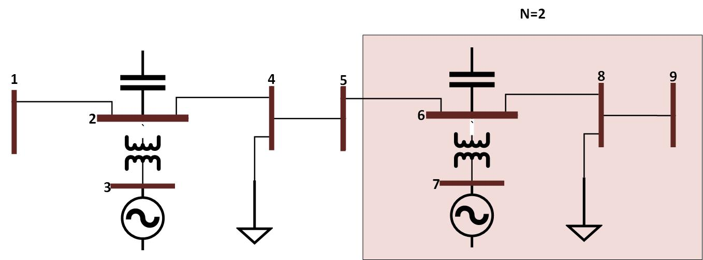

# Unit Test Design for ExaGO OPFLOW's  Objective Function

## Goal
Design the scalable unit test for the OPFLOW optimization function.

## Objective function

OPFLOW does a minimization of the generation cost and the generation cost function is assumed to be a polynomial function of order 2.
```math
\begin{aligned}
C = \sum_{k=1}^{ng} \alpha_kP^2_{Gk} + \beta_kP_{Gk} + \gamma_k + \sum_{j=1}^{nl}c_{\delta{S_Dj}}({\delta{P^2_{Dj}} + \delta{Q^2_{Dj}}}) 
+ \sum_{i=1}^{nb}c_{\delta{S_i}}({\delta{P^2_{i}} + \delta{Q^2_{i}}})
\end{aligned}
```
where, $`\alpha_k`$, $`\beta_k`$, and $`\gamma_k`$ are the generator $`k`$ cost-cofficients. $`c_{\delta{S_Dj}}`$ is the penalty cost for $`j^{th}`$ load loss, and $`c_{\delta{S_i}}`$ is the penalty cost for power imbalance at bus $`i`$; $`n_g`$, $`n_l`$, and $`n_b`$ are number of generators, number of loads and number of buses; $`P_{Gk}`$ is the real power injection of the generator $`k`$; $`\delta{P_{Dj}}`$ and $`\delta{Q_{Dj}}`$ are real and reactive power load loss for each load $`j`$ if enabled; $`\delta{P^2_{i}}`$ and $`\delta{Q^2_{i}}`$ are real and imaginary power imbalance variables; 

For the purpose of this unit test, last two terms will be assumed zero (and are zero by design).
## Input file
### Format
ExaGO OPFLOW reads .m file, thus the input file for unit test is in this format.
### Topology
A network, that consist of:
- 5 buses (1-5)
- 1 generator unit (at bus 3)
- 1 transformer (between buses 2 and 3)
- 3 lines (1-2, 2-4, 4-5)
- 1 switched shunt (at bus 2), and 
- 1 load (at bus 4) is being created.
Figure below shows the oneline diagram of the test network:


### Values
Following are the value of parameters of interest for this test:

- $`\alpha_{k}=0.01`$
- $`\beta_{k}=0.1`$
- $`\gamma_{k}=8`$
- $`P_{Gk}=10`$


With this, value of the objective function is equal 10. 

## Scaling
Idea is to be able to "multiply" the network, and at the same time being able to **easily** evaluate the objective function. Network shown before is considered as a base segment (N=1).

Figure 2 shows the proposed multiplication of the grid with two segments connected (N=2):


### Algorithm
Algorithm for the .m file generation with N segments of the base network is:
#### Bus data:
- Copy all but first bus data (column) N times and increment the numbering (First value in the column): (N-1)*4+First.
- Set all Second values in columns of elements with First number euqual to N*4-1 for N>1 (e.g., 7, 11, 15) to 2. This steps ensure that all buses with generator unit are marked as PV buses, and the first one with the generator is SLACK (Secund=3 instead of 2).
- Total number of buses for N segments is N*4+1.
#### Generator data:
- Copy generator data N times.
- ONLY the first value in the generator field (bus number) needs to be updated for each copy = 3+(N-1)*4.
#### Generator cost data:
- Copy generator cost data N times.
#### Branch data:
- Copy all four branches N times.
- First two values in each columns are changing as follows: (N-1)*4+First and (N-1)*4+Second.
#### Bus name data:
- Copy all but first bus name data N times and increment the numbering: (N-1)*4+First. 
#### Generator unit types data:
- Copy generator unit types data N times.
#### Generator fuel types data:
- Copy generator fuel types data N times.

With this, objective function on N segments is equal to N*10.
