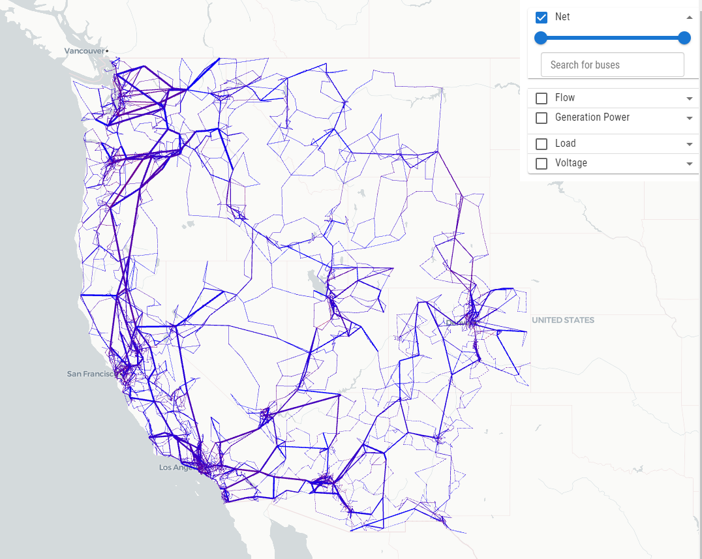
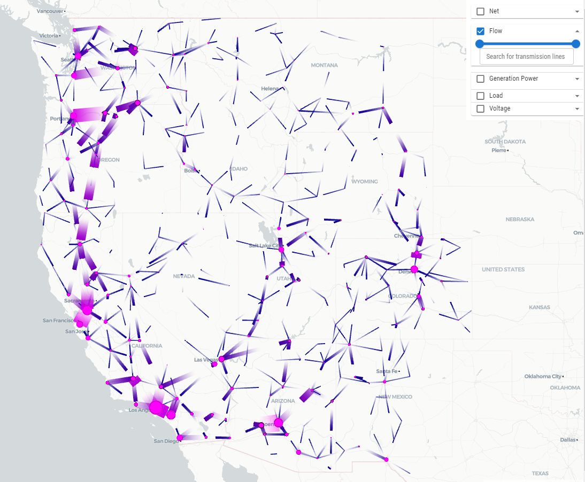
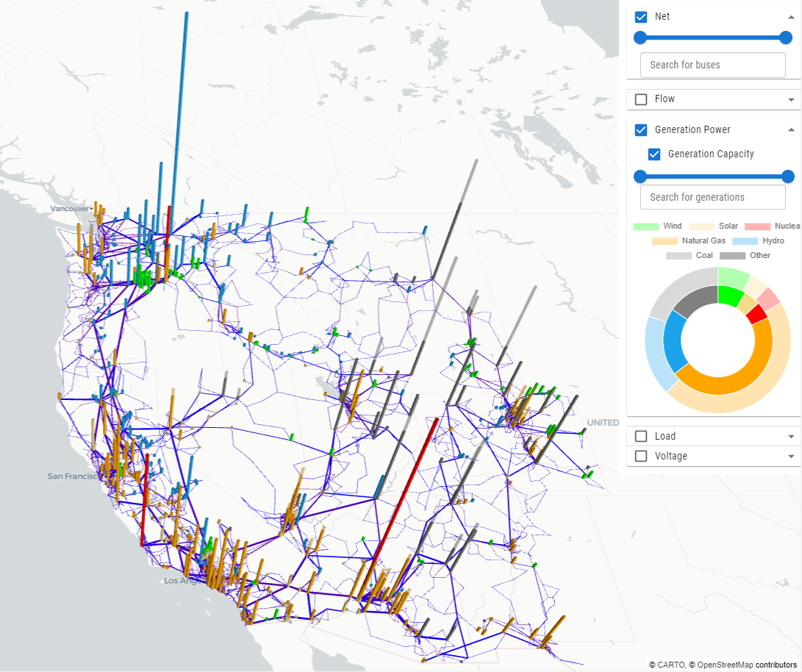
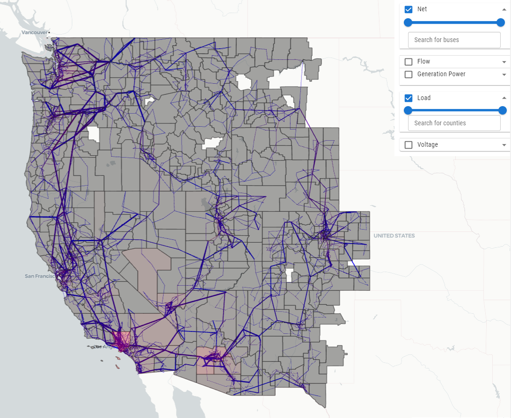
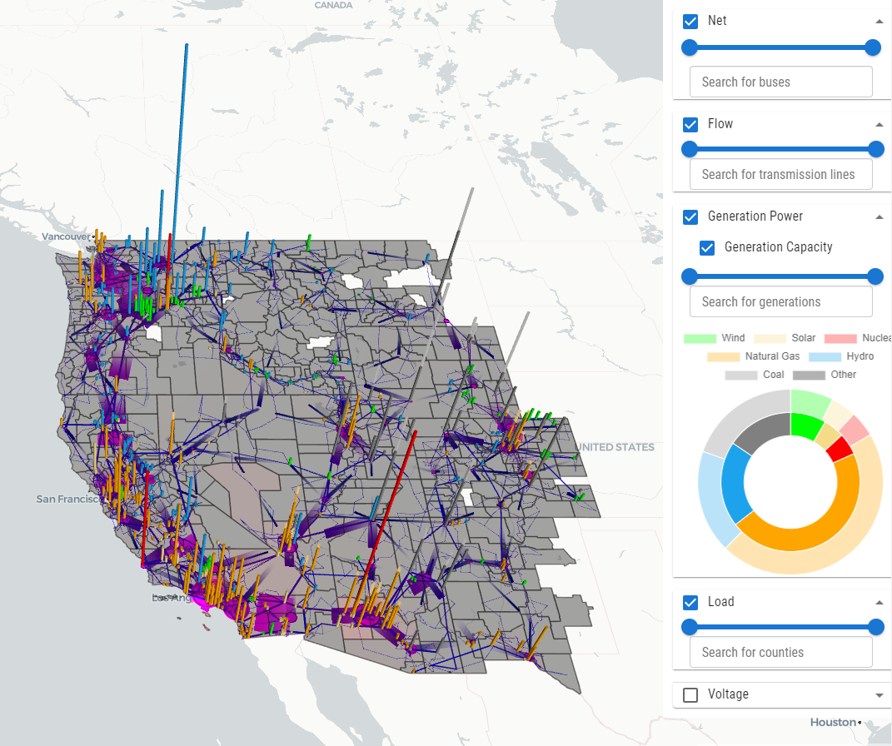
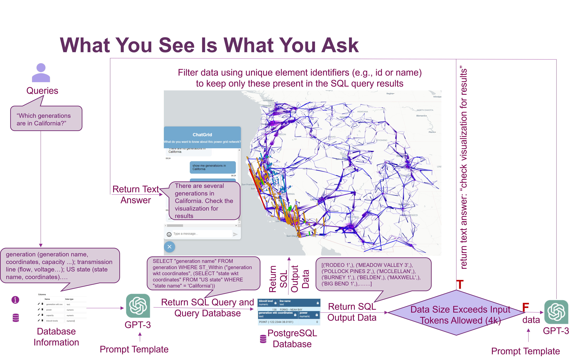
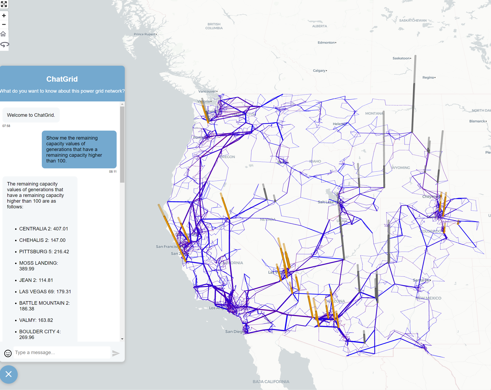

# ExaGO visualization (experimental)
ExaGO has an experimental visualization platform for visualizing the results of OPFLOW on a map provided the geospatial coordinates for the network are available. On launching the visualization, a webpage displays the given power system network overlayed on a geospatial map. The (experimental) visualization features include: 
  - Map-based network layout of the grid
  - Reading in the grid data through a geojson file.
  - Fly-in (zoom in) on bus, branch, county 
  - County-based load and voltage heatmaps
  - Bar chart layer and double pie-chart for generation dispatch and capacity
  - Filters based on network voltage, generation dispatch level, and voltage/load level
  - Zoomed-in display of county load or voltage (aggregated)

## Preparing input data files for visualization
The visualization uses a `JSON` formatted file as an input. This `JSON` file has a specific structure (To do: explain structure for the file) and there are several sample files for different network in the `data` subdirectory.
This input JSON file can be either created externally OR generated as an output of the `OPFLOW` application. When using OPFLOW, the following command will generate the input JSON file.
```
./opflow -netfile <netfile> -save_output -opflow_output_format JSON -gicfile <gicfilename>  
```
Note that the `OPFLOW` application is available in the `$EXAGO_INSTALL/bin` directory where `$EXAGO_INSTALL` is the ExaGO installation directory.

The above command will run a `OPFLOW` on the given network and generate an output file called `opflowout.json`. The `-gicfile` is an additional option one can provide to provide the file that has the geospatial coordinates (latitude/longitude) for the network. If the geospatial coordinates are not provided then OPFLOW draws the network as a circle. It is highly recommended that one provides the geospatial coordinate file as an input to display the network correctly on the map. The geospatial coordinate file should have the same format as used for the [Electric Grid Test Case Repository](https://electricgrids.engr.tamu.edu/) synthetic networks. 

Copy over the `opflowout.json` file to the `viz/data` subdirectory. Next, run the python script `geninputfile.py` to load the JSON file in the visualization script.
```
python geninputfile.py opflowout.json
```

Note: If you have created the JSON file externally then simply copy it over in the `viz/data` subdirectory and run the `geninputfile.py` script using the above command.

## Preparing the database for query
Behind the scenes, LLM translates natural language queries into SQL queries to retrieve data from a database. As the power grid network is a typical geospatial dataset, we choose PostgreSQl + PostGIS database for the convenience of conducting spatial queries. Please follow the steps below to set up your PostgreSQL database that contains the power grid network dataset. 

First, we need to convert the ExaGO output `.json` files to `.csv` files. The difference between the two data formats is that JSON stores attributes and values as dictionary pairs but CSV stores attributes and values as tables. You can write your own script for this conversion or use the provided script. 

To use the provided script, first copy the ExaGO output `.json` file to the `viz/data` subdirectory and simply run the following script in the `viz/data` subdirectory (replace the example filename with your json filename). This will output three CSV files: `generation.csv`, `bus.csv`, and `tranmission_line.csv`.
```
python jsontocsv.py case_ACTIVSg10k.json
```

## Installation

### Docker Compose

ExaGO's visualization bundled with ChatGrid can now conveniently be installed with [Docker Compose](https://docs.docker.com/compose/). Installation instructions for Docker Compose can be found [here](https://docs.docker.com/compose/install/).

After Docker Compose is installed `cd` into `ExaGO/viz` and edit the `setup.env` file with your [OpenAI API key](https://platform.openai.com/api-keys) and passwords. Then run:

`sudo docker compose up --build -d`

And that's it! You'll be set up and ready to go. ExaGO's visualization will be available at `localhost:8080`, and pgadmin will be available at `localhost:5050` if you need to troubleshoot the database. Consult the `setup.env` file if you have any issues logging into pgadmin or connecting to your database.

To shutdown the ExaGO visualization run:

`sudo docker compose down`

Cached and unused docker images can take up a lot of storage space. To clean things up run:

`sudo docker system prune -a`

### Manual Installation (Deprecated)
ExaGO visualization uses the following tools to generate the visuals.
- [Node.js@v16.13.0](https://nodejs.org/es/blog/release/v16.13.0)
- Facebook's [React](https://reactjs.org/) framework
- Uber's [Deck.gl](https://deck.gl/docs) visualization
- [React-map-gl](https://visgl.github.io/react-map-gl/) framework
- [Chart.js](https://www.chartjs.org/)

Before launching the visualization, one needs to install these packages. This can be done with the following two steps:
1. Install [Node.js](https://nodejs.org/en/)
2. Do `npm install --legacy-peer-deps` in this directory (`viz`)to install all the dependencies.

> [!WARNING]  
> Per https://github.com/pnnl/ExaGO/issues/129 `--legacy-peer-deps` is required as an argumnet to `npm install`. This will ideally be removed once the vizualization is no longer experimnetal.

### Launch visualization
To launch the visualization, run
```
npm start
```
This will open a webpage with the visualization of the given network. 


The figures show the visualization of the synthetic electric grid. The data for developing this visualization was created by merging the synthetic dataset for the [Eastern](https://electricgrids.engr.tamu.edu/electric-grid-test-cases/activsg70k/), [Western](https://electricgrids.engr.tamu.edu/electric-grid-test-cases/activsg10k/), and [Texas](https://electricgrids.engr.tamu.edu/electric-grid-test-cases/activsg2000/) interconnects from the [Electric Grid Test Case Repository](https://electricgrids.engr.tamu.edu/)
### 2D synthetic US western grid network display


### 2D synthetic US western grid tranmission line flow display


### 2.5D synthetic US western grid network display with generation overlapped and doughnut chart for generataion mix


### 2.5D synthetic US western grid displaying load profile by counties


### 2.5D synthetic US western grid displaying network, flow, generation, and load


### Demo 
See [Here](../tutorials/demo1.ipynb) 

### ChatGrid
ChatGrid is a natural language query tool for ExaGO visualizations. It is powered by OpenAI GPT-3.5-Turbo and Langchain. ChatGrid allows users to query on ExaGO visualizations through natural language and returns text summaries and visual outputs as answers. The following flow chart shows the architecture design of ChatGrid.


#### Dependencies
ChatGrid is built upon the following services and tools. 
- [OpenAI LLMs](https://platform.openai.com/docs/models/overview)
- [Langchain@0.0.233](https://python.langchain.com/docs/get_started/introduction.html) framework
- [PostGreSQL](https://www.postgresql.org/download/) database
- [Flask](https://flask.palletsprojects.com/en/2.3.x/) framework 

### Installing the database
    
1. Download PostgreSQL database from this [link](https://www.postgresql.org/download/) and install it. 

2. Create a PostgreSQL database and import the `.csv` files to it.

    There are many ways to do that. If you are not familiar with SQL commands, you can use `pgAdmin 4` (a GUI management program of PostgreSQL database, usually installed along with PostgreSQL) and follow [this instruction](https://learnsql.com/blog/how-to-import-csv-to-postgresql/) to import the `.csv` files (e.g., generation.csv, bus.csv, tranmission_line.csv, counties.csv, US states.csv) to PostgreSQL database.

    Note: 

      a. Please write down your username, password, database name and keep them in a safe place. You will need this information to connect to the database later. 

      b. Please be informative and accurate about your table names, and attribute names. Because this information can help LLM understand the dataset and performs better when dealing with user queries.

      c. Include US state and county information in your database to support spatial queries that related to state or county.   
    

3. Connect to your database.

    Open the `config.py` file in the `viz/backend` subdirectory and replace `YOUR_DATABASE_PASSWORD` and `YOUR_DATABASE_NAME`  with your own database password and database name.


### Getting your OpenAI API key
ChatGrid uses GPT models from OpenAI to process natural language queries. To use LLMs from OpenAI, you first need to go to [OpenAI's Platform website](https://platform.openai.com) and sign in with an OpenAI account. Click your profile icon at the top-right corner of the page and select "View API Keys." Click "Create New Secret Key" to generate a new API key. 

Open the `config.py` in the `viz/backend` subdirectory replace `YOUR_OPENAI_KEY` with your own OpenAI API key.


<!-- data script -->
<!-- installation: pip install -r requirements.txt in the backend directory-->
### Launch backend
ChatGrid uses Flask to host the service of receiving user queries and returning the data output and text summaries to update the visualizations on the frontend. Please follow the steps below to run the backend server.

1. Go to the `viz/backend` subdirectory and use the `pip install -r requirements.txt` command to install all the Python dependencies.
2. Run the following command in the `viz/backend` subdirectory
    ```
    python server.py
    ```
    This will start the backend server for receiving user queries, processing it by LLM and returning data outputs to the frontend. 

Now open the chat window on the frontend, type your queries, and enjoy ChatGrid!


### Optional: model configuration 
If you would like to test different LLMs with ChatGrid, you can specify the `model_name="YOUR_LLM_MODEL"` in the `viz/backend/sqlchain.py` file. 
