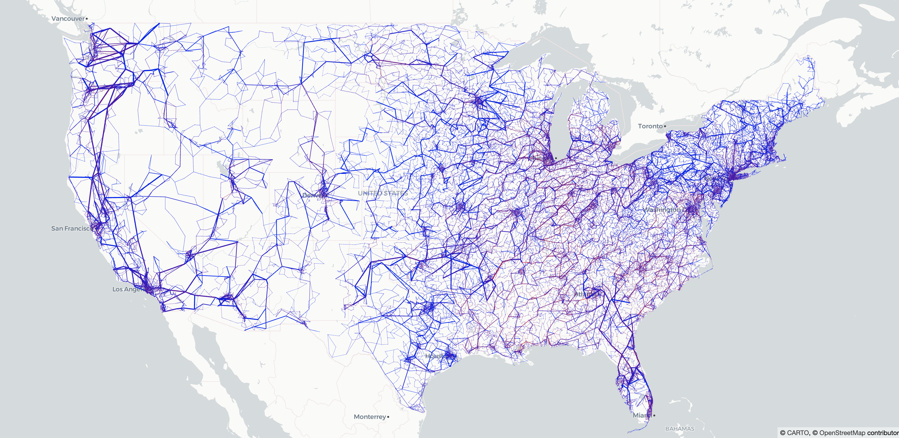
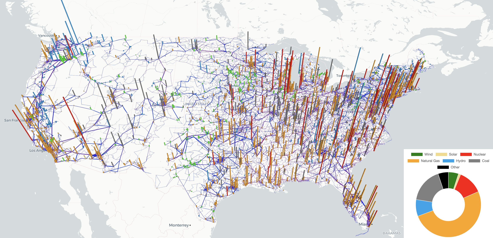
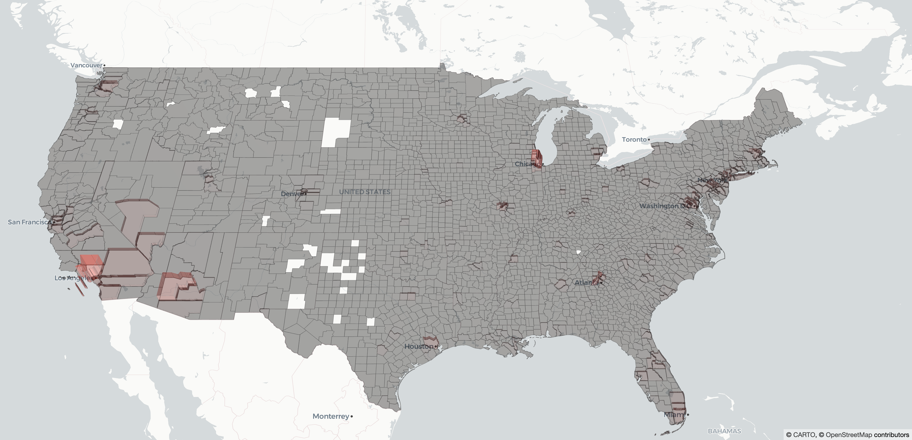

# ExaGO visualization (under construction)
ExaGO visualization uses several visualization tools to generate the visuals. Specific tools used are
- Facebook's [React](https://reactjs.org/) framework
- Uber's [Deck.gl](https://deck.gl/docs) visualization
- [React-map-gl](https://visgl.github.io/react-map-gl/) framework
- [Chart.js](https://www.chartjs.org/)

The figures show the visualization of the synthetic electric grid. The data for developing this visualization was created by merging the synthetic dataset for the [Eastern](https://electricgrids.engr.tamu.edu/electric-grid-test-cases/activsg70k/), [Western](https://electricgrids.engr.tamu.edu/electric-grid-test-cases/activsg10k/), and [Texas](https://electricgrids.engr.tamu.edu/electric-grid-test-cases/activsg2000/) interconnects from the [Electric Grid Test Case Repository](https://electricgrids.engr.tamu.edu/)
### 2D synthetic grid network display


### 2.5D synthetic grid network display with generation overlapped and doughnut chart for generataion mix


### 2.5D synthetic grid displaying load profile by counties


### 2.5D synthetic grid displaying network, generation, and load


### Usage
# Install [Node.js](https://nodejs.org/en/)

# Install dependencies
```
npm install
```

# Launch visualization
```
npm start
```