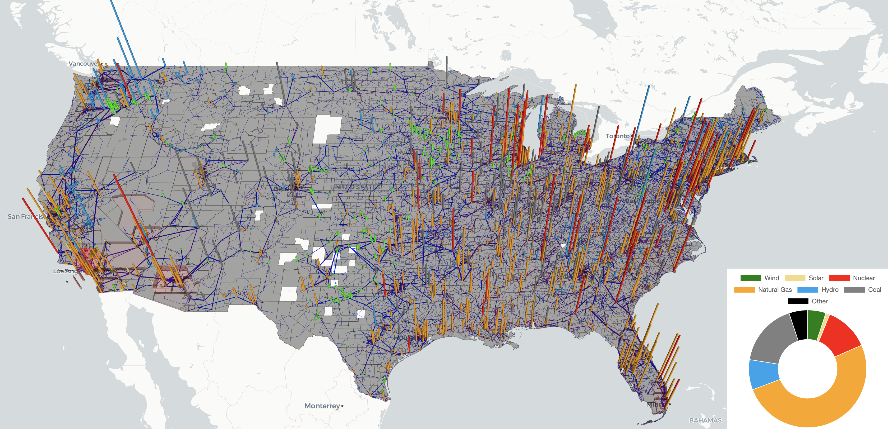

# ExaGO visualization (experimental)
ExaGO has an experimental visualization platform for visualizing the results of OPFLOW on a map provided the geospatial coordinates for the network are available. On launching the visualization, a webpage displays the given power system network overlayed on a geospatial map. The (experimental) visualization features include: 
  - Map-based network layout of the grid
  - Reading in the grid data through a geojson file.
  - Fly-in (zoom in) on bus, branch, county 
  - County-based load and voltage heatmaps
  - Bar chart layer and double pie-chart for generation dispatch and capacity
  - Filters based on network voltage, generation dispatch level, and voltage/load level
  - Zoomed-in display of county load or voltage (aggregated)


## Installation
ExaGO visualization uses the following tools to generate the visuals.
- [Node.js](https://nodejs.org/en/)
- Facebook's [React](https://reactjs.org/) framework
- Uber's [Deck.gl](https://deck.gl/docs) visualization
- [React-map-gl](https://visgl.github.io/react-map-gl/) framework
- [Chart.js](https://www.chartjs.org/)

Before launching the visualization, one needs to install these packages. This can be done with the following two steps:
1. Install [Node.js](https://nodejs.org/en/)
2. Do `npm install` in this directory (`viz/data`)to install all the dependencies.

## Preparing input data files for visualization
The visualization uses a `JSON` formatted file as an input. This `JSON` file has a specific structure (To do: explain structure for the file) and there are several sample files for different network in the `data` subdirectory.
This input JSON file can be either created externally OR generated as an output of the `OPFLOW` application. When using OPFLOW, the following command will generate the input JSON file.
```
./opflow -netfile <netfile> -save_output -opflow_output_format JSON -gicfile <gicfilename>  
```
Note that the `OPFLOW` application is available in the `$EXAGO_INSTALL/bin` directory where `$EXAGO_INSTALL` is the ExaGO installation directory.

The above command will run a `OPFLOW` on the given network and generate an output file called `opflowout.json`. The `-gicfile` is an additional option one can provide to provide the file that has the geospatial coordinates (latitude/longitude) for the network. If the geospatial coordinates are not provided then OPFLOW draws the network as a circle. It is highly recommended that one provides the geospatial coordinate file as an input to display the network correctly on the map. The geospatial coordinate file should have the same format as used for the [Electric Grid Test Case Repository](https://electricgrids.engr.tamu.edu/) synthetic networks. 

Copy over the `opflowout.json` file to the `viz/data` subdirectory. Next, run the python script `geninputfile.py` to load the JSON file in the visualization script.
```
python geninputfile.py opflowout.json
```

You are ready to launch the visualization now. 

Note: If you have created the JSON file externally then simply copy it over in the `viz/data` subdirectory and run the `geninputfile.py` script using the above command.

## Launch visualization
To launch the visualization, run
```
npm start
```
This will open a webpage with the visualization of the given network. 

The figures show the visualization of the synthetic electric grid. The data for developing this visualization was created by merging the synthetic dataset for the [Eastern](https://electricgrids.engr.tamu.edu/electric-grid-test-cases/activsg70k/), [Western](https://electricgrids.engr.tamu.edu/electric-grid-test-cases/activsg10k/), and [Texas](https://electricgrids.engr.tamu.edu/electric-grid-test-cases/activsg2000/) interconnects from the [Electric Grid Test Case Repository](https://electricgrids.engr.tamu.edu/)
### 2D synthetic grid network display


### 2.5D synthetic grid network display with generation overlapped and doughnut chart for generataion mix


### 2.5D synthetic grid displaying load profile by counties


### 2.5D synthetic grid displaying network, generation, and load


